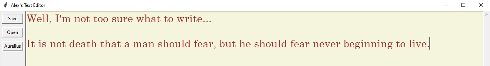

# Marcus Aurelius Text Editor

## Overview

The Marcus Aurelius Text Editor is a simple text editor built using Python's Tkinter library. It allows users to open and save text files, as well as insert prewritten quotes attributed to Marcus Aurelius.

## Features

- **Open File:** Open and edit existing text files.
- **Save File:** Save the current text content to a new or existing file.
- **Insert Aurelius Quote:** Insert a randomly selected quote from Marcus Aurelius into the text.

## Usage

1. **Open File:**
   - Click the "Open" button or use the shortcut `Ctrl + O`.
   - Select a text file from the file dialog.
   - The content of the selected file will be displayed in the text editor.

2. **Save File:**
   - Click the "Save" button or use the shortcut `Ctrl + S`.
   - Choose a destination and file name in the file dialog.
   - The current content of the text editor will be saved to the specified file.

3. **Insert Aurelius Quote:**
   - Click the "Aurelius" button to insert a random quote attributed to Marcus Aurelius into the text editor.

## Installation

1. Ensure you have Python installed on your system.
2. Clone or download the repository.
3. Run the script using the command: `python text_editor.py`.

## Dependencies

- **Tkinter:** Tkinter is Python's standard GUI (Graphical User Interface) package and comes bundled with most Python installations.

## Contributing

Contributions are welcome! If you have suggestions or improvements, feel free to submit a pull request.

## Author
Alex McKinley

## License

This text editor is released under the [MIT License](LICENSE).
